# RUN4LYF: Intelligent Bio-Kinematic Pacing & Alert Engine
### A Closed-Loop Cybernetic System for Biomechanical Music Adaptation & Athlete Safety
**Embedded Systems & Robotics Intern – AI Hardware Technical Assignment**

---

[](https://www.python.org/)
[](https://streamlit.io/)
[](https://www.espressif.com/en/products/socs/esp32-s3)
[](https://www.st.com/)
[](https://librosa.org/)
[](#)

---

## 🏃‍♂️ 1. Executive Summary & Genesis

Every endurance runner knows the transformative power of music: an anthemic track can push you through the pain barrier, while a sluggish acoustic ballad during an uphill interval shatters your stride rhythm. 

Conventional music players (Spotify, Apple Music) treat running as a static shuffle problem, offering static playlists labeled *"160 BPM Cardio"*. However, human running physiology is **fundamentally dynamic**:
1. **Warmup Inertia**: Runners begin at 130–145 Steps Per Minute (SPM) as muscles warm up. Forcing 175 BPM music at second zero causes cognitive friction and increases injury risk.
2. **Cardiac Drift**: Over prolonged workouts, dehydration and core heat induce *cardiac drift*—heart rate creeps into Zone 4/5 danger thresholds even as cadence declines.
3. **The "Half-Time Trap Gap"**: Traditional running algorithms only look for $BPM \approx SPM$. If a runner loves hip-hop, trap, Punjabi drill, or indie ballads (produced at 80–95 BPM), standard apps reject them. In reality, striking the ground on every 8th note (half-time) of an 85 BPM beat equates to a **170 SPM cadence**—a flawless auditory-motor match!

**RUN4LYF** (Run For Life) was conceived out of personal curiosity to design a small, intelligent, wearable embedded system that treats music not as passive audio, but as an **active acoustic actuator** within a classical **Sense $\rightarrow$ Process $\rightarrow$ Decide $\rightarrow$ Act** cybernetic control loop.

---

## 🔁 2. The Cybernetic Model: Sense $\rightarrow$ Process $\rightarrow$ Decide $\rightarrow$ Act

The runner's body (musculoskeletal stride and cardiovascular response) serves as the **plant** in a closed-loop feedback controller:

```mermaid
flowchart LR
    subgraph Plant ["Human Athlete (The Plant)"]
        LEGS["Musculoskeletal Stride\n(Cadence & Ground Shock)"]
        HEART["Cardiovascular System\n(Heart Rate & Cardiac Drift)"]
    end

    subgraph Sense ["1. SENSE"]
        IMU["6-DOF IMU (LSM6DSOX)\nAccel + Gyro @ 100 Hz"]
        PPG["Optical PPG (MAX30102)\nPulse & SpO2 @ 50 Hz"]
    end

    subgraph Process ["2. PROCESS (Edge DSP)"]
        AUTOCORR["Autocorrelation Step Extraction"]
        EMA["Discrete-Time EMA Filter"]
        FSM["Biometric State Machine\n{WARMUP, CRUISE, KICK, FATIGUE, COOLDOWN, HAZARD}"]
    end

    subgraph Decide ["3. DECIDE (Intelligent Policy)"]
        HARMONIC["Harmonic Octave Folding\n(1:1 Direct & 2:1 Half-Time)"]
        UTILITY["Multi-Objective Utility Optimizer"]
        STAGING["20s Pre-Transition Staging Buffer\n& 20s Minimum Playback Lock"]
    end

    subgraph Act ["4. ACT (Actuator Layer)"]
        STRETCH["Micro-Tempo Stretch DSP (±3.5%)"]
        XFADE["Equal-Power DJ Crossfader"]
        ALERTS["Audio Safety Chimes & Metronome"]
        AUDIO_OUT["I2S DAC / Headphone Stream"]
    end

    LEGS --> IMU
    HEART --> PPG
    IMU & PPG --> AUTOCORR --> EMA --> FSM --> HARMONIC --> UTILITY --> STAGING
    STAGING --> STRETCH & XFADE & ALERTS --> AUDIO_OUT
    AUDIO_OUT -. "Auditory-Motor Entrainment (100-120ms Latency)" .-> Plant
```



---

## 🛠️ 3. Hardware Selection & Embedded Architecture

The physical system was architected to satisfy four strict constraints: **deterministic real-time audio I/O**, **ultra-low power consumption** for marathon runtimes, **compact wearable form factor**, and **accessible BOM cost**:

| Subsystem Component | Selected Hardware | Technical Specifications | Engineering Selection Rationale |
| :--- | :--- | :--- | :--- |
| **Microcontroller / Core** | **Espressif ESP32-S3** | Dual-core 32-bit Xtensa LX7 @ 240MHz, 512KB SRAM, 8MB PSRAM, BLE 5.0 | Features dedicated vector instructions (PIE) for accelerated DSP filtering. Asymmetric dual-core architecture dedicates Core 0 to sensor I2C/BLE and Core 1 to continuous I2S audio streaming, completely preventing audio buffer underruns. |
| **Motion Transducer (IMU)** | **STMicroelectronics LSM6DSOX** | 6-DOF (3-axis Accel $\pm 16g$, 3-axis Gyro $\pm 2000$ dps), 9KB FIFO | 0.55 mA active current. Hardware FIFO enables batch interrupt-driven transfers via DMA, allowing the MCU to sleep between strides. Embedded Machine Learning Core (MLC). |
| **Physiological Sensor** | **Maxim MAX30102** | Optical PPG pulse oximeter, dual red/IR LEDs, I2C interface | Sub-2 mA active power. Provides continuous arterial pulse reflectance and HRV for cardiac drift and fatigue estimation. |
| **Audio DAC & Amplifier** | **Maxim MAX98357A** | I2S digital input Class-D mono amp, 3.2W output, 92% efficiency | Direct 3-wire digital PCM connection (BCLK, LRC, DIN) eliminates analog ground loops and electromagnetic interference caused by arm swinging. |
| **Power PMIC** | **TI TPS63001** | High-efficiency buck-boost converter, 3.3V fixed output up to 800mA | Delivers a rock-solid 3.3V rail as the LiPo cell discharges from 4.2V down to 3.0V (96% peak efficiency). |
| **Battery Cell** | **Li-Polymer 3.7V 500mAh** | Single pouch cell with integrated PCM protection circuit | Ultra-lightweight (~9.5 grams), compact ($30 \times 25 \times 6\text{ mm}$), powers the device for **13.2 continuous hours**. |

### Electrical Power Budget & Battery Life:

$$\text{Continuous Current Draw } I_{total} = I_{MCU} (24.0\text{mA}) + I_{IMU} (0.55\text{mA}) + I_{PPG} (1.8\text{mA}) + I_{DAC} (7.5\text{mA}) + I_{PMIC} (0.15\text{mA}) \approx \mathbf{34.0\text{ mA}}$$

$$\text{Battery Endurance} = \frac{500\text{ mAh} \times 0.90 \text{ (derated capacity)}}{34.0\text{ mA}} \approx \mathbf{13.2\text{ Hours}}$$

> [!NOTE]
> A 500mAh battery cell provides over **13 hours of continuous operation**—more than triple the duration of a standard 4-hour marathon!

---

## 🧮 4. Signal Processing, Mathematics & AI Algorithms

### 4.1 Kinematic Step Extraction via Autocorrelation
To isolate foot strikes from random arm swing and body tilt, raw 3-axis accelerometer readings are converted to the **Dynamic Jerk Magnitude**:

$$a_{mag}(t) = \sqrt{a_x^2(t) + a_y^2(t) + a_z^2(t)} - 1.0\text{g}$$

Cadence is extracted using **Normalized Short-Time Autocorrelation** over a sliding 2.0-second window ($N = 200$ samples @ 100 Hz):

$$R_{xx}(\tau) = \frac{\sum_{n=0}^{N-\tau-1} x[n] \cdot x[n+\tau]}{\sqrt{\sum x^2[n] \cdot \sum x^2[n+\tau]}}, \quad \tau \in [30, 55]\text{ samples (110–200 SPM)}$$

$$\tau^* = \arg\max_{\tau} R_{xx}(\tau) \implies \text{Cadence (SPM)} = \frac{60 \cdot f_s}{\tau^*}$$

### 4.2 Harmonic Octave Matching Theory ($1:1$ vs. $2:1$)
To bridge the gap between human gait and diverse musical genres (trap, Punjabi hip-hop, drill, pop, indie), the engine evaluates candidate harmonic frequencies:

$$\mathcal{H}(BPM) = \left\{ BPM, 2 \cdot BPM \text{ (if } BPM \le 115\text{)}, \frac{BPM}{2} \text{ (if } BPM \ge 130\text{)} \right\}$$

$$\text{Score}_{tempo} = \exp\left( -\frac{\min_{b \in \mathcal{H}} (b - SPM)^2}{2 \sigma^2} \right), \quad \sigma = 7.0\text{ SPM}$$

### 4.3 Multi-Objective Utility Function
For candidate track $i$ and runner state $S_t$:

$$U(i | S_t) = 0.45 \cdot \text{Score}_{tempo}(i) + 0.30 \cdot \text{Score}_{energy}(i) + 0.25 \cdot \text{Score}_{mood}(i) - \text{Penalty}_{recency}(i)$$

### 4.4 Anti-Thrashing Invariant & 20-Second Pre-Transition Staging Buffer
To prevent jarring track hopping when parameters or stride rates fluctuate:
1. **Strict 20-Second Playback Lock**: A track is strictly locked to play for **at least 20 real seconds** (`wall_elapsed >= 20.0s` and `sim_elapsed >= 20.0s`). Even under aggressive parameter changes (e.g. toggling mood from *Chill* to *Beast Mode*), the song will not switch prematurely.
2. **20-Second Pre-Transition Staging Countdown**: When a transition condition is met, the system does not cut abruptly. It enters a 20-second staging buffer:
   $$\tau_{remaining} = \max(0.0, 20.0 - \Delta t)$$
   The current track continues playing while the runner receives a visual pre-cue and the audio engine aligns downbeat phases. The crossfade only executes when $\tau_{remaining} = 0.0\text{s}$.
3. **Emergency Override**: If a `HAZARD_ALERT` (cadence collapse <50 SPM or stumble) occurs, the buffer is bypassed immediately to trigger audible warning tones.

---

## 💻 5. Streamlit Interactive Prototype

The prototype features a dark-mode athletic cybernetic dashboard (`code/app.py`):

```
+-----------------------------------------------------------------------------------+
|  RUN4LYF: Cybernetic Bio-Pacing Engine                                           |
|  Sense -> Process -> Decide -> Act • Closed-Loop Rhythmic Entrainment             |
+-----------------------------------------------------------------------------------+
| [SPM: 162.4]  [HR: 148 BPM (Z2)]  [Pace: 5:41 min/km]  [Distance: 2.4km]  [14:22] |
+-----------------------------------------------------------------------------------+
|  🎧 Dynamic Audio Actuation Deck           |  📊 Biometric & Hardware Telemetry   |
|  [STATE: STEADY_FLOW] [🔒 20s Lock: 8s left] |  ----------------------------------  |
|  Track: Monica - Run Down The City        |  [ Cadence (SPM) vs Target Chart ]   |
|  Native BPM: 136.0 • Mode: 1:1 Direct     |  ----------------------------------  |
|  Micro-Stretch: +1.8% (1.018x)            |  [ Heart Rate (BPM) & Drift Chart ]  |
|  [▶ Play / Pause Audio Player (Autoplay)] |  ----------------------------------  |
|                                           |  🔬 Edge MCU Telemetry (ESP32-S3):   |
|  🔀 DJ TRANSITION BUFFER (20s Pre-Cue)    |  - Accel Z Shock: 1.82 g             |
|  Queued: Everybody Dies by Billie Eilish  |  - Pitch Gyro: 41.2 °/s              |
|  [=======>               ] 12.5s to switch|  - Step Event: DETECTED 🟢           |
+-----------------------------------------------------------------------------------+
|  🎯 Intelligent Utility Score Ranking (Top Candidate Pool)                        |
|  1. Monica           | BPM: 136 | Tempo: 0.98 | Energy: 0.88 | Utility: 0.862     |
|  2. Everybody Dies   | BPM: 123 | Tempo: 0.94 | Energy: 0.74 | Utility: 0.814     |
|  3. Naal Nachna      | BPM: 143 | Tempo: 0.89 | Energy: 0.62 | Utility: 0.785     |
+-----------------------------------------------------------------------------------+
```

### Key UI Capabilities:
- **Continuous Autoplay**: Audio automatically begins playing on workout start and smoothly crossfades between tracks hands-free.
- **Smooth Parameter Adjustments**: Adjusting mood (*Chill Flow, Focused Pacing, Beast Mode, Recovery Jog*) or pace profile (*Slow, Medium, Fast, Ultra*) updates targets dynamically via `runner.update_profile(...)` without restarting the runner back to 0:00.
- **Live Event Perturbations**: Interactive buttons to simulate realistic scenarios:
  - 🚀 **Sprint Finish**: Surges cadence and heart rate to test `SPRINT_KICK` transition.
  - ⛰️ **Hill Surge**: Cadence sags while heart rate spikes, testing incline compensation.
  - 🥱 **Fatigue Drop**: Cadence collapses while cardiac drift accelerates.
  - 🛑 **Stumble / Stop**: Instant cadence collapse (<50 SPM), triggering `HAZARD_ALERT`.

---

## 📂 6. Repository Structure

```
RUN4LYF/
├── code/
│   ├── Data/musiclib/              # 21 high-fidelity FLAC audio tracks across genres
│   ├── track_catalog.json          # Precomputed MIR acoustic feature cache (BPM, Energy, Mood)
│   ├── audio_scanner.py            # Offline MIR feature extraction pipeline (SoundFile + Librosa)
│   ├── synthetic_runner.py         # Biomechanical human runner simulator (Jitter, Drift, Perturbations)
│   ├── pacing_engine.py            # Closed-loop cybernetic decision algorithm & 20s staging buffer
│   ├── app.py                      # Interactive Streamlit cybernetic web dashboard
│   └── __init__.py                 # Python package descriptor
├── documentation/
│   ├── 01_PROBLEM_AND_USE_CASE.md  # Detailed sports science, AMS neurology, and target personas
│   ├── 02_SYSTEM_ARCHITECTURE.md   # Sense-Process-Decide-Act data flows, timing & latency budget
│   ├── 03_HARDWARE_AND_EMBEDDED_DESIGN.md # BOM selection, schematics, pinout matrix & power budget
│   ├── 04_ALGORITHMS_AND_MATHEMATICS.md   # Derivations for autocorrelation, EMA, harmonic folding
│   ├── 05_SOFTWARE_AND_LIBRARIES.md       # Code walkthrough, library choices, performance optimizations
│   └── 06_INTERVIEW_PREP_AND_TRADE_OFFS.md # Comprehensive interview cheat sheet (15 technical Q&As)
├── RUN4LYF_Embedded_Robotics_Assignment.html # Semantic HTML source of the formal submission report
├── RUN4LYF_Embedded_Robotics_Assignment.pdf  # Exact 4-page publication assignment report
├── YourName_Embedded_Robotics_Assignment.pdf # Submission copy (ready to rename with candidate name)
└── README.md                       # Master technical documentation
```

---

## 🚀 7. Quickstart & Installation

### Prerequisites
- Python 3.10+
- Conda environment or virtual environment with `streamlit`, `librosa`, `soundfile`, `scipy`, `numpy`

### 1. Launch the Interactive Web Dashboard:
```bash
# Using conda environment:
/home/rtx/miniconda3/envs/minor/bin/streamlit run code/app.py
```
Open **`http://localhost:8501`** in your browser.

### 2. Run the Pacing Engine Integration Test:
```bash
/home/rtx/miniconda3/envs/minor/bin/python -c "
import sys, json
sys.path.insert(0, 'code')
from synthetic_runner import SyntheticRunner
from pacing_engine import PacingEngine

with open('code/track_catalog.json') as f:
    catalog = json.load(f)

runner = SyntheticRunner(mood='Focused Pacing', pace_profile='Medium', target_dist_km=5.0)
engine = PacingEngine(catalog=catalog, user_mood='Focused Pacing', target_spm=runner.target_spm)

for t in range(5):
    pkt = runner.step(1.0)
    decision = engine.process(pkt, 1.0)
    print(f't={t}s: State={decision[\"state\"]} | SPM={decision[\"ema_cadence_spm\"]} | Track={decision[\"current_track\"][\"title\"]}')
"
```

### 3. Re-index Audio Library (Optional):
```bash
/home/rtx/miniconda3/envs/minor/bin/python code/audio_scanner.py
```

---

## 🎯 8. Technical Interview Preparation & Trade-Offs

When discussing this project with technical interviewers, highlight these key design decisions:

1. **Why not run full Librosa beat tracking live on the microcontroller?**
   > *Audio files are static. A song's BPM, dynamic energy, and downbeat grid never change once recorded. Running STFT and tempograms live on a wearable MCU wastes battery and compute. We precompute features once into a lightweight JSON database, saving MCU CPU cycles for real-time I2S DMA streaming and 100 Hz sensor filtering.*
2. **What is Optical PPG "Cadence Lock" and how do you solve it?**
   > *When a runner's foot strikes the pavement, mechanical displacement causes the optical pulse sensor to bounce against the skin, tricking the photodiode into tracking step frequency (e.g. 165 SPM) instead of arterial pulse (145 BPM). We solve this via cross-axis spectral subtraction: sampling the IMU at 100 Hz, calculating the dominant foot strike frequency, and notch-filtering that exact peak out of the PPG reflectance signal.*
3. **How does the system prevent song thrashing?**
   > *Through a three-tier hysteresis guard: continuous micro-tempo stretching ($\pm 3.5\%$) for small variations, an absolute 20-second minimum track playback lock, and a 20-second pre-transition staging countdown buffer that provides acoustic anticipation before crossfading.*
4. **Why choose ESP32-S3 over Raspberry Pi Zero 2W or STM32?**
   > *A Pi Zero 2W runs full Linux (25-second boot time, 150–200 mA current draw draining a 500mAh cell in 2.5 hours). An STM32 requires external BLE/Wi-Fi and PSRAM, inflating BOM cost. The ESP32-S3 provides dual-core real-time determinism, hardware vector instructions, integrated BLE 5.0, boots in under 100ms, and draws only ~34 mA.*

---

## 📄 9. Formal Assignment Submission Deliverables

- **Official PDF Report**: [`RUN4LYF_Embedded_Robotics_Assignment.pdf`](file:///run/media/rtx/Files/Code/Projects/fun/RUN4LYF/RUN4LYF_Embedded_Robotics_Assignment.pdf)
- **Submission Naming Requirement**: [`YourName_Embedded_Robotics_Assignment.pdf`](file:///run/media/rtx/Files/Code/Projects/fun/RUN4LYF/YourName_Embedded_Robotics_Assignment.pdf)
- **Deep Technical Dossier**: [`documentation/`](file:///run/media/rtx/Files/Code/Projects/fun/RUN4LYF/documentation/)

*Designed and engineered with curiosity, scientific rigor, and athletic passion.*
